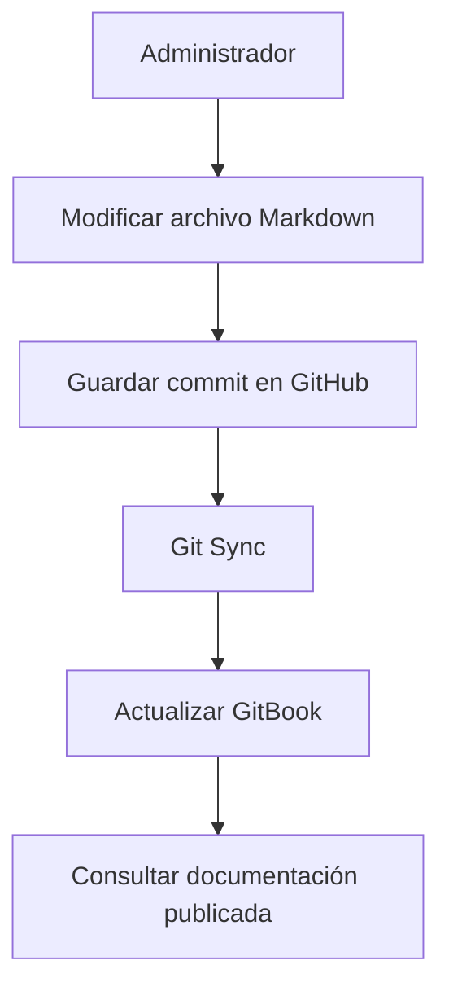

## 6. Flujo de actualización de la documentación

Representamos el proceso mediante el cual actualizamos
la documentación técnica utilizando Docs as Code.

```mermaid
graph TD
    A[Administrador] --> B[Modificar archivo Markdown]
    B --> C[Guardar commit en GitHub]
    C --> D[Git Sync]
    D --> E[Actualizar GitBook]
    E --> F[Consultar documentación publicada]
```

